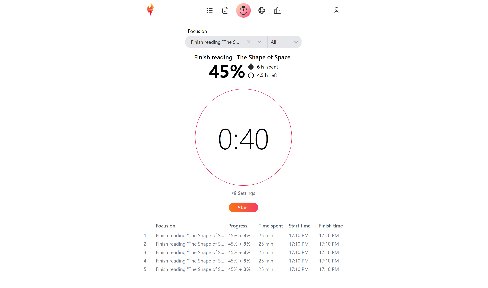

# Torch

An app that helps you track the time you spend pursuing your goals.

✅ Create tasks, goals, or dreams according to their size and scope.\
✅ Sort and filter your tasks according to priority, deadline date, and your current progress metrics.\
✅ Get visual feedback on your progress.\
✅ Use Pomodoro timer to track your time.

  

## TODO

- [x] Tasks/Goals/Dreams list page
- [x] Task form modal
- [x] Goal form modal
- [x] Dream form modal
- [ ] Implement `prefers-reduced-motion` media query
- [x] Refactor the modal component (if possible)
- [ ] Redo duration input to match what's in the Android timer
- [ ] Make so that a user may work towards a goal when it has subtasks
- [ ] Connect "start timer" button in goals list to the timer page
- [ ] Add React Query
- [ ] Investigate which state management library to use for forms and list page
- [x] Rewrite all of the state management in Goals list page with Jotai or Zustand
- [ ] Disable edit mode when there are no items in the list
- [ ] Add timer toast
